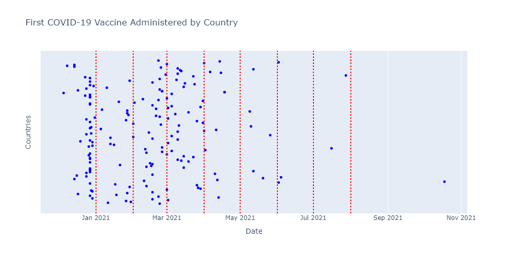
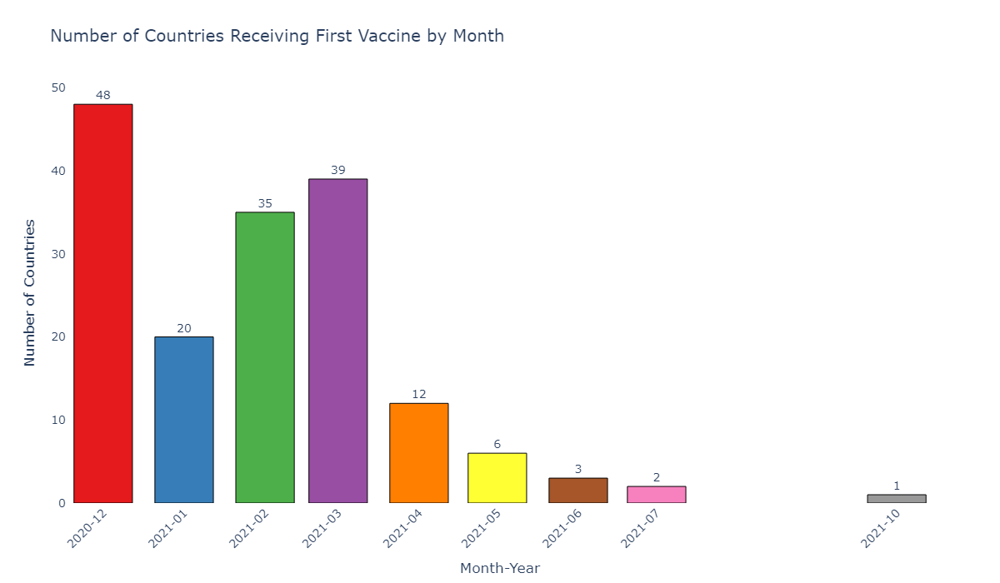
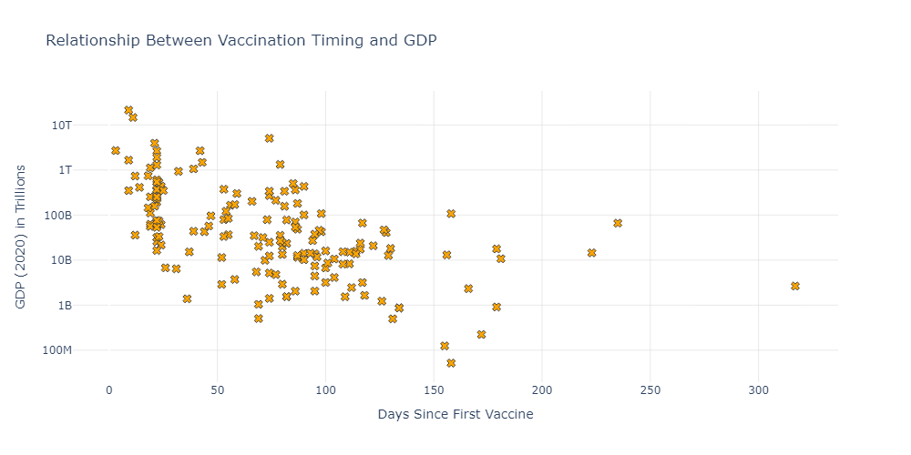
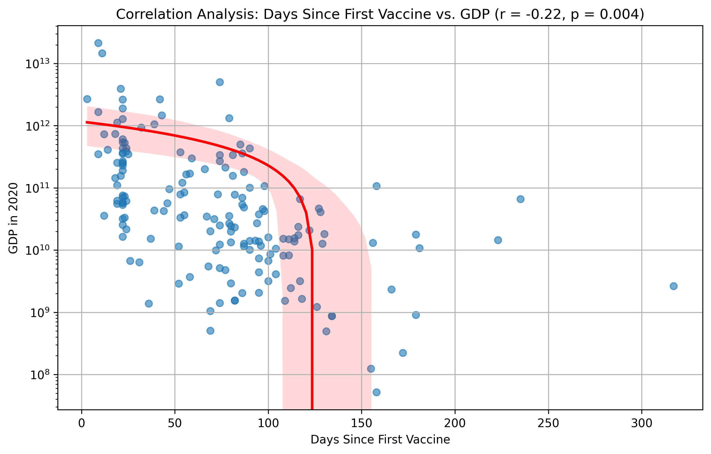
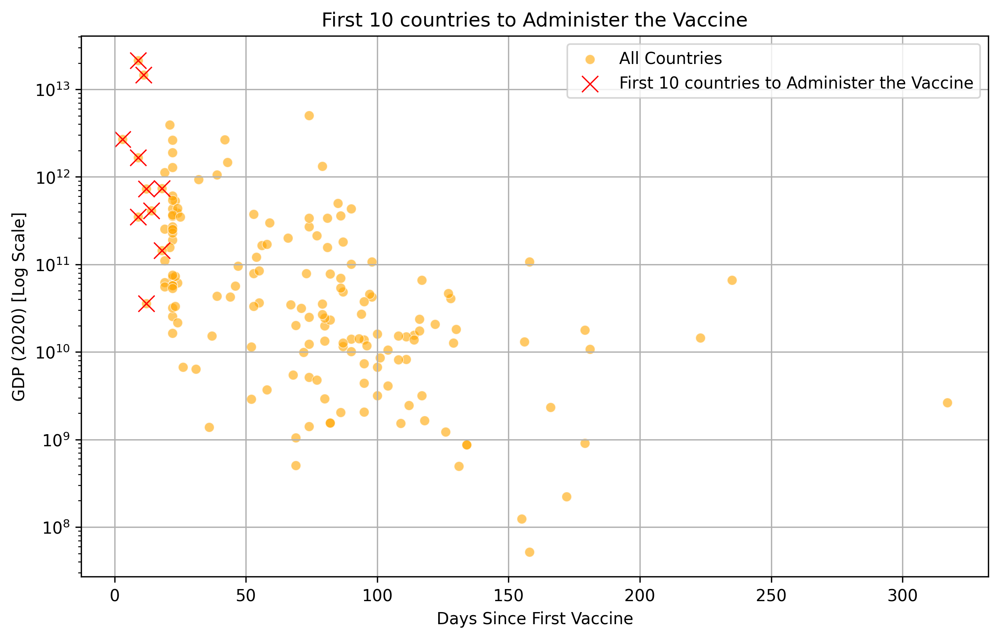
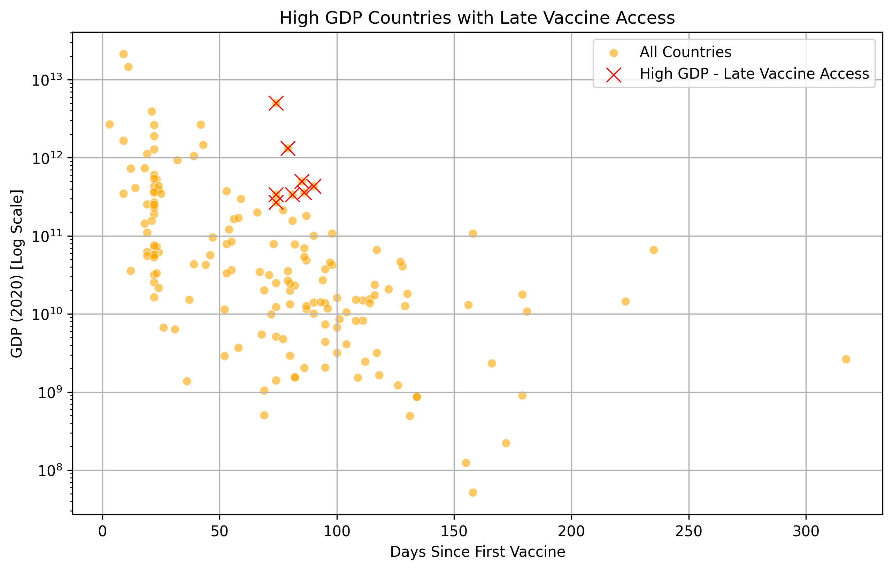
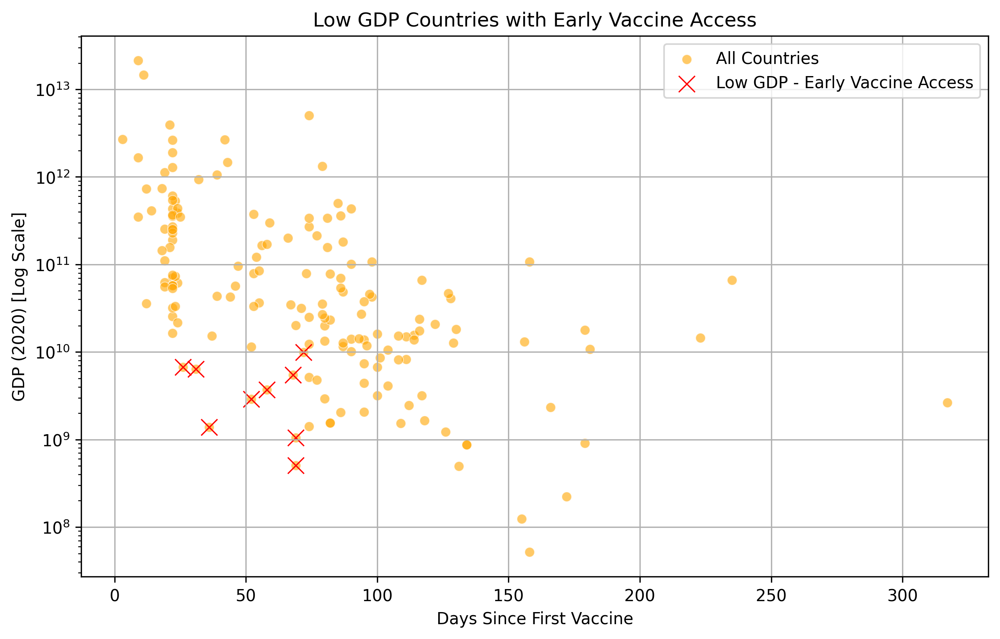
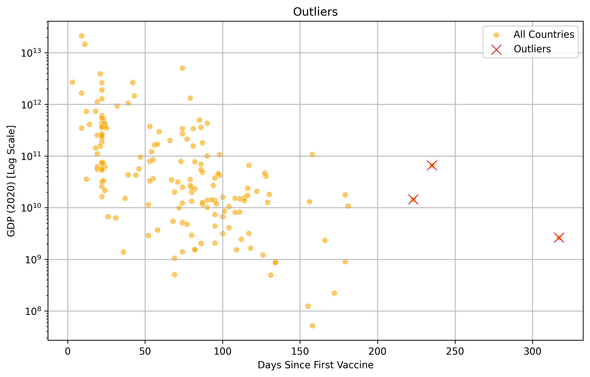

# Political Influence On Covid Vaccination Distribution

[Download Report](Political_Influence_On_Covid_Vaccination_Distribution.pdf)

This report analyzes disparities in COVID-19 vaccine rollouts across countries, highlighting a significant correlation between early vaccine administration dates and higher national GDP, indicating political and economic inequities in global vaccine distribution.

## Key Findings

- **Disproportionate Early Access:** In December 2020, wealthier nations or countries with stronger political ties received COVID-19 vaccines first, leading to an early advantage in vaccine rollout.
- **Supply Shortages:** January 2021 experienced a significant reduction in global vaccine availability, primarily impacting lower-GDP nations, due to prior hoarding by economically powerful countries.
- **Correlation with GDP:** GDP showed a weak but notable correlation with earlier vaccine rollout, indicating economic strength influenced vaccine timing but wasn't the only determining factor.

## Timeline of global vaccine doses administered
Timeline of global vaccine doses administered, showing initial surges and shortages.

## Monthly Distribution of First COVID-19 Vaccine Administration
Countries receiving their first COVID-19 vaccine dose by month, emphasizing early disparities.

## First Vaccine Administration for each Country vs GDP
Scatter plot illustrating relationship between national GDP and date of first vaccine administration.

## Correlation Analysis
Statistical correlation analysis confirming GDP significantly influenced vaccine rollout speed.

## First 10 Countries to Administer the Vaccine
List of the first 10 countries that initiated COVID-19 vaccinations, predominantly high-GDP nations.

## High GDP Late Access Countries
Countries with high GDP but unexpectedly delayed access to COVID-19 vaccines.

## Low GDP Early Access Countries
Low-GDP countries achieving early vaccine access through strategic political alliances or agreements.

## Outliers
Identified outlier countries that diverged notably from GDP-based vaccine rollout trends.

## Author

- [@roycefernandes3](https://github.com/roycefernandes3/)
